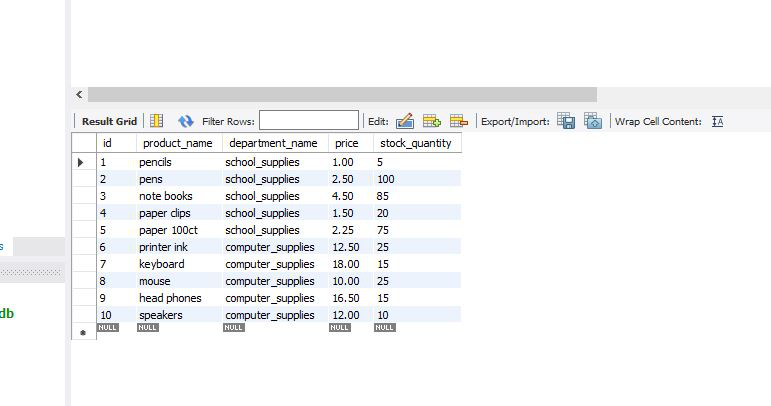

# **Node.js & mySQL Assignment**
## Homework Assignment 10 -bAmazon DB
## GitHub Repository - 

### Overview

### The purpose of this excercise was to build an application that could pull data from a simple MySQL database using Node.js from the core cocept reviewed in class.  This app used an Amazon like purchase sytem where the user could choose from a list of avaiable products and be allowed to choose the quantity required.  The primary app have a few core functions
#### Return an intial DB pull of all items on intially running the node.js script from the mySQL NPM package:

#### Provide user prompts via the inquirer package to determine users requested product and quantitiy:

#### Once the user has selected thier choice, JS runs another call to the SQL DB to determine if thier are sufficient quantities on-hand to fulfill the order.  If enough are on hand, the terminal will return the total cost of the purchase and how many are still on haand for purchase.  Finally the user will be put back in the intial display screen for more choices:

#### If it is determined that there are not enough on had to fil the order, the terminal will return a message that there are not enough on hand and then promt the user to enter new command promts after items have been displayed:

#### finally the SQL DB will be updated using the MyDQL package and update commands:
 